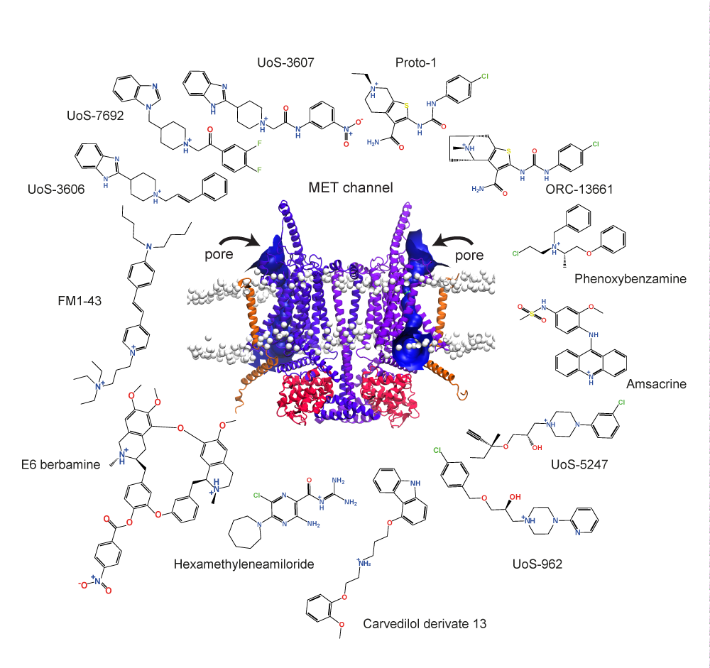
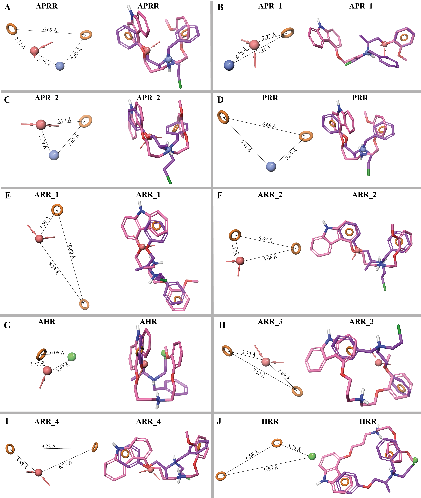

# 3D ligand-based pharmacophore models for MET channel block

We analyzed the chemical structures of known MET channel blockers and identified 3D-pharmacophoric features that contribute to their antagonistic activity. These 3D elements may include specific functional groups, spatial arrangements, or physicochemical properties that are essential for binding to the MET channel and modulation of its function. We used the software Phase to design 3D pharmacophore models representing the main 3D elements of known MET channel blockers. These 3D-pharmacophore features were extracted by assembling a training set consisting of 13 structurally diverse compounds, which included UoS-7692, UoS-3607, UoS-3606, UoS-5247, UoS-962, Proto-1, E6-berbamine, hexamethyleneamiloride, amsacrine, phenoxybenzamine, carvedilol-derivate 13, ORC-13661, and FM1-43.

Here we provide the 10 predicted pharmacophores in .phypo format that can be viewed on Maestro Viewer, the actives compounds for each of the pharmacophores and the decoys used to for the validation of the pharmacophore models.

**Figure 1. Structural diversity of known MET blockers.** Compounds reported to display varied MET channel blocker. Front view a of our dimeric TMC1 model (purple) in complex with two protomers of TMIE (orange) and two protomers of CIB2 (red) proteins. Heads of phospholipids are showed as white beads. Arrows represent the entry site of small molecules via the pores in both TMC1 protomers calculated by HOLE (blue).

**Figure 2. 3D view of the 10 common pharmacophores of 13 known MET channel blockers.**(A-K) Pharmacophore models of MET channel blockers (Figure 1). Hydrogen-bond acceptor features (A) in red, aromatic rings (R) in orange circles, positively charged group (P) in blue, and hydrophobic group (H) in green beads. Distances between the vector features are labeled. Superposed structures of the MET blockers phenoxybenzamine (purple) and carvedilol derivative 13 (pink) with the vector features of each pharmacophore. These two compounds fit to all the 10 pharmacophores.
