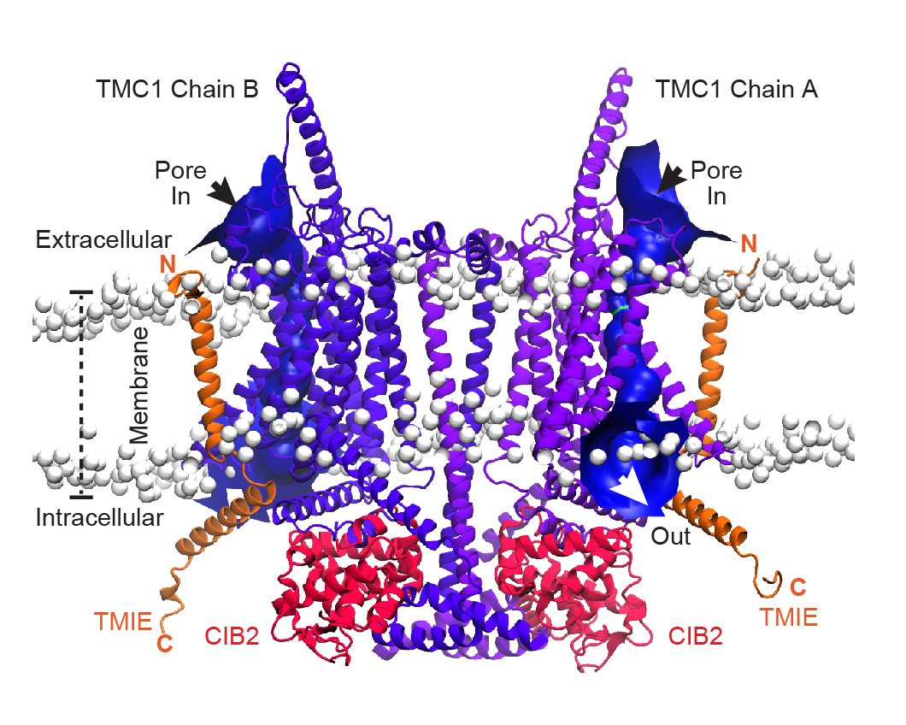

# Mechano Electrical Transducer (MET) Channel complex

In the absence of 3D-atomic structures of the mammalian MET-channel complex, we constructed a model of the complex by assembling Mus musculus (Mm) TMC1 subunits with MmCIB2 and MmTMIE, adopting
an open-like conformation with domain swapping feature at transmembrane domain 10 (TM10). This model was constructed using AlphaFold2 through the ColabFold github repository. The assembled complex was compared with the cryo-EM structure of the expanded CeTMC-1 complex, confirming that the TM10 domain was in the typical domain-swapped conformation, which is a structural requirement for the proper oligomerization of MmTMC1.

The model was subjected to energy minimization, followed by embedding into a pre-equilibrated 1-palmitoyl-2-oleoyl-sn-glycero-3-phosphocholine (POPC) phospholipid membrane and solvation with a final ionic concentration of 15 mM KCl. Subsequently, the system underwent 25 ns of restrained equilibrium molecular dynamics simulation (MDs). Here we provide the frame structure at 24 ns post-equilibration of the MET complex.

**Figure 1. TMC1 modeling and molecular dynamics simulations..** Compounds reported to display varied MET channel blocker. Front view a of our dimeric TMC1 model (purple) in complex with two protomers of TMIE (orange) and two protomers of CIB2 (red) proteins. Heads of phospholipids are showed as white beads. Arrows represent the entry site of small molecules via the pores in both TMC1 protomers calculated by HOLE (blue).
